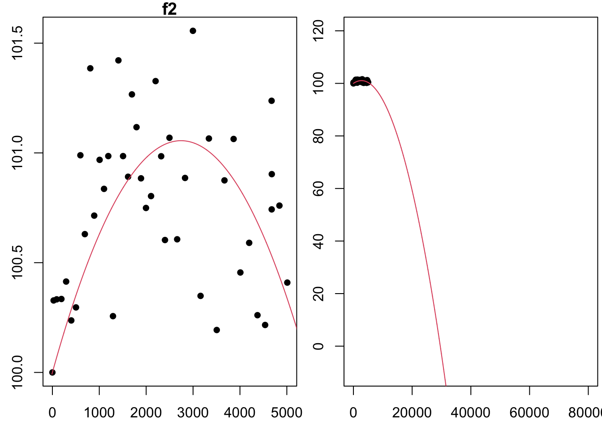

### Maximum Likelihood Method for $f_2$

Consider the model $f_2(t; a_1, a_2) = 100 + a_1t + a_2t^2$. The function $f_2$ models the brightness of a lightbulb, measured as a percent of the original intensity of the lightbulb, given the number of hours the lightbulb as been on, $t$. We will fit $f_2$ to the list of 44 measurements, $(t_i,y_i)$, obtained from the data4led package using the seed 123.

Assuming the residuals (or errors) are independent and normally distributed (with mean 0 and standard deviation 1), the loglikelihood function for these errors is

```{=tex}
\begin{align*}
\ell_2(a_1,a_2; \mathbf{t},\mathbf{y}) = 44\ln\left(\frac{1}{\sqrt{2\pi}}\right) + \sum_{i=1}^{44}
\left(-\frac{1}{2}(y_i - 100 - a_1t_i - a_2t_i^2)^2\right).
\end{align*}
```
We want to find the maximum of $ℓ_2$. The first partials of $ℓ_2$ are

\begin{align*}
\frac{\partial\ell_2}{\partial a_1} =
\left(\sum_{i=1}^{44} (y_i - 100)t_i\right) -
\left(\sum_{i=1}^{44}t_i^2\right)a_1 -
\left(\sum_{i=1}^{44}t_i^3\right)a_2 
\end{align*} and \begin{align*}
\frac{\partial\ell_2}{\partial a_2} =
\left(\sum_{i=1}^{44} (y_i - 100)t_i^2\right) -
\left(\sum_{i=1}^{44}t_i^3\right)a_1 -
\left(\sum_{i=1}^{44}t_i^4\right)a_2
\end{align*}

To find the critical points of $ℓ_2$, we set each partial derivative above equal to zero and then solve

```{=tex}
\begin{array}{ll}
\left(\sum_{i=1}^{44} (y_i - 100)t_i\right) -
\left(\sum_{i=1}^{44}t_i^2\right)a_1 -
\left(\sum_{i=1}^{44}t_i^3\right)a_2 &= 0 \\
\left(\sum_{i=1}^{44} (y_i - 100)t_i^2\right) -
\left(\sum_{i=1}^{44}t_i^3\right)a_1 -
\left(\sum_{i=1}^{44}t_i^4\right)a_2 &= 0.
\end{array}
```
.

We notice that this system is of the form

```{=tex}
\begin{align*}
b_1 - c_{11}a_1 - c_{12}a_2 &= 0 \\
b_2 - c_{21}a_1 - c_{22}a_2 &= 0,
\end{align*}
```
with

```{=tex}
\begin{align*}
c_{11} = \sum_{i=1}^{44}t_i^2 \\
c_{12} = c_{21} = \sum_{i=1}^{44} t_i^3, \\
c_{22} = \sum_{i=1}^{44} t_i^4, \\
b_1 = \sum_{i=1}^{44} (y_i - 100)t_i, \\
b_2 = \sum_{i=1}^{44} (y_i - 100)t_i^2.
\end{align*}
```
::: cell
``` {.r .cell-code}
library(data4led)
bulb <- led_bulb(1,seed=5372) 

t <- bulb$hours
y <- bulb$percent_intensity

c.11 <- sum(t^2)
c.12 <- sum(t^3)
c.22 <- sum(t^4)
b.1 <- sum((y-100)*t)
b.2 <- sum((y-100)*t^2)
```
:::

Since we noticed this system is of a general form we have already solved, then we can use the solution from previous work. We found that the solution to this system is

```{=tex}
\begin{align*}
a_2 =
\frac{c_{11}b_2 - c_{12}b_1}{c_{11}c_{22} - c_{12}^2}\text{ and }a_1 =
\frac{b_1 - c_{12}a_2}{c_{11}}.
\end{align*}
```
Below we use R to calculate $a_1$ and $a_2$ using the formula above.

::: cell
``` {.r .cell-code}
best.a2 <- (c.11*b.2 - c.12*b.1)/(c.11*c.22 - c.12^2) 
best.a1 <- (b.1 - c.12*best.a2)/c.11 
#While we calculate them in reverse order, let's display them in order
best.a1
```

::: {.cell-output .cell-output-stdout}
    [1] 0.0007697492
:::
:::

::: cell
``` {.r .cell-code}
best.a2
```

::: {.cell-output .cell-output-stdout}
    [1] -1.403114e-07
:::
:::

The critical point for $ℓ_2$ is $(a_1,a_2)=(0.0011909,−1.7435215×10−7)$. Let's use the second derivative test to confirm that this critical point is the location of a maximum of $ℓ_2$. The second partials of $ℓ_2$ are below. We will need the second partials for the second derivative test.

```{=tex}
\begin{align*}
\frac{\partial^2\ell_2}{\partial a_1^2} = - \sum_{i=1}^{44}t_i^2 \\
\frac{\partial^2\ell_2}{\partial a_2^2} = - \sum_{i=1}^{44}t_i^4 \\
\frac{\partial^2\ell_2}{\partial a_2 \partial a_1} = -\sum_{i=1}^{44}t_i^3
\end{align*}
```
We then compute

```{=tex}
\begin{align*}
D =
\left(\frac{\partial^2\ell_2}{\partial a_1^2}\right)\left(
\frac{\partial^2\ell_2}{\partial a_2^2}\right) -
\left(\frac{\partial^2\ell_2}{\partial a_2 \partial a_1}\right)^2 =
\left(- \sum_{i=1}^{44}t_i^2\right)\left(- \sum_{i=1}^{44}t_i^4\right) -
\left(- \sum_{i=1}^{44}t_i^3\right)^2.
\end{align*}
```
To use the second derivative test, we need numerical values for both D and $\frac{∂^2ℓ_2}{∂a_1^2}$. The code below computes both these values.

::: cell
``` {.r .cell-code}
D <- (-c.11)*(-c.22) - (-c.12)^2
D
```

::: {.cell-output .cell-output-stdout}
    [1] 1.23003e+23
:::
:::

::: cell
``` {.r .cell-code}
-c.11 #the second partial with respect to a1 twice
```

::: {.cell-output .cell-output-stdout}
    [1] -328767530
:::
:::

::: cell
``` {.r .cell-code}
f2 <- function(x,a0=0,a1=0,a2=1){
  a0 + a1*x + a2*x^2
}

a0 <- 100
a1 <- best.a1
a2 <- best.a2

x <- seq(-10,80001,2)
par(mfrow=c(1,2),mar=c(2.5,2.5,1,0.25))
plot(t,y,xlab="Hour ", ylab="Intensity(%) ", pch=16,main='f2')
lines(x,f2(x,a0,a1,a2),col=2)
plot(t,y,xlab="Hour ", ylab="Intensity(%) ", pch=16, xlim = c(-10,80000),ylim = c(-10,120))
lines(x,f2(x,a0,a1,a2),col=2)
```

::: cell-output-display
{width="672"}
:::
:::
